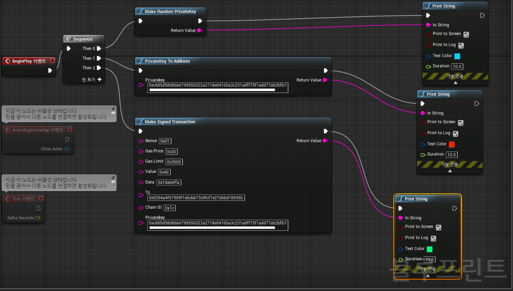

# Gameper Unreal Ethereum Plugin
[](https://shields.io/)    [](https://shields.io/)


This is a lightweight unreal Ethereum plugin. This plugin provides basic ethereum wallet features. You can use Major Ethereum functions with Blueprint node. Or you can modify the plugin as you wish.

This plugin provides:
1. Make Signed Transaction
2. Make Random Private Key
3. Private Key to Address

There is no web3provider on this plugin. You should fetch nonce, or gasprice... using rest api(e.g. VaRest)

If you want to make smart-contract transaction, you should make data from somewhere and put it into the data field of the makeSignedTransaction node.




Maybe you want to have your random source more entrophy. See function **string makeRandomPrivateKey(int seed)** from Source/GameperETH/eth.cpp.


## How to use
1. Download this repository.
2. Put this directory into the YourProject/Plugins/
3. Enable GameperETH on the Unreal Plugin window.


## Function List
```
UFUNCTION(BlueprintCallable, meta = (DisplayName = "Make Signed Transaction", Keywords = "Ethereum"), Category = "GameperETH")
static FString GameperETH_MakeSignedTransaction(
    const FString& nonce,
    const FString& gasPrice,
    const FString& gasLimit,
    const FString& value,
    const FString& data,
    const FString& to,
    const FString& chainID,
    const FString& privatekey
);
```

```
UFUNCTION(BlueprintCallable, meta = (DisplayName = "Make Random PrivateKey", Keywords = "Ethereum"), Category = "GameperETH")
static FString GameperETH_makeRandomPrivateKey(/*const uint32 seed*/);
```

```
UFUNCTION(BlueprintCallable, meta = (DisplayName = "PrivateKey To Address", Keywords = "Ethereum"), Category = "GameperETH")
static FString GameperETH_getAddress(const FString& privatekey);
```


Reference from
- https://github.com/firefly/wallet
- https://github.com/kvhnuke/Ethereum-Arduino